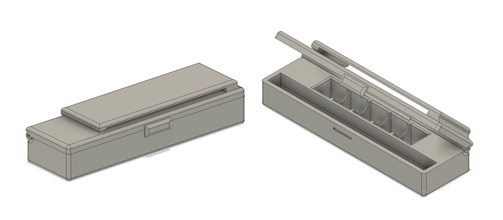
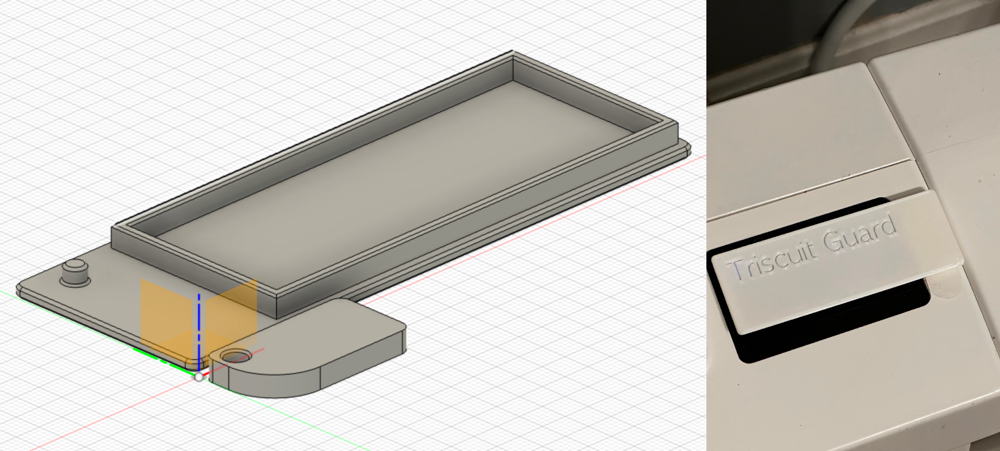
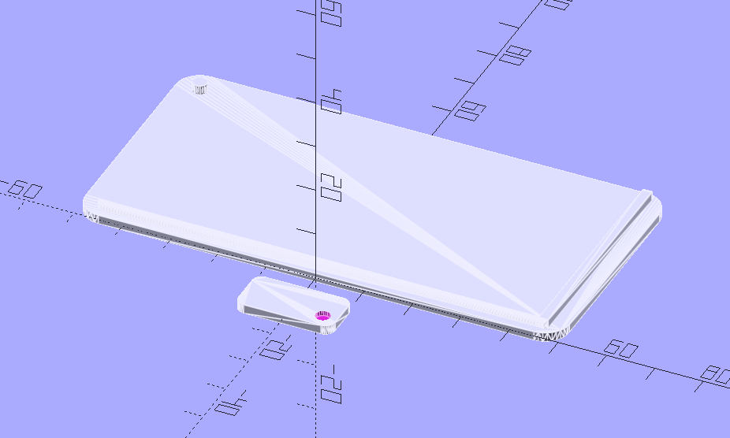
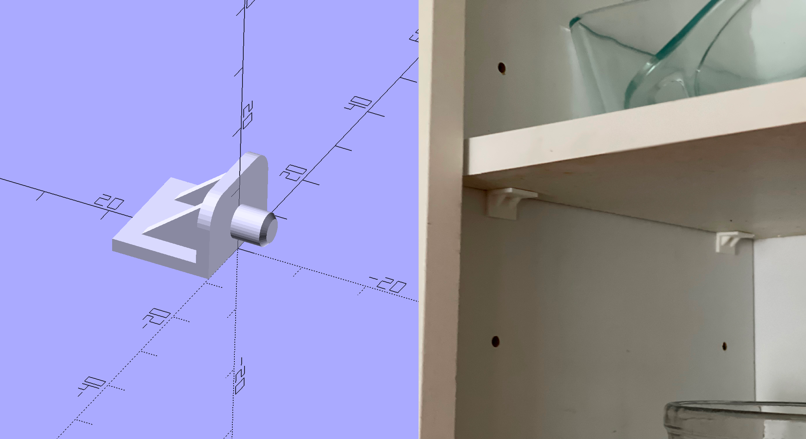
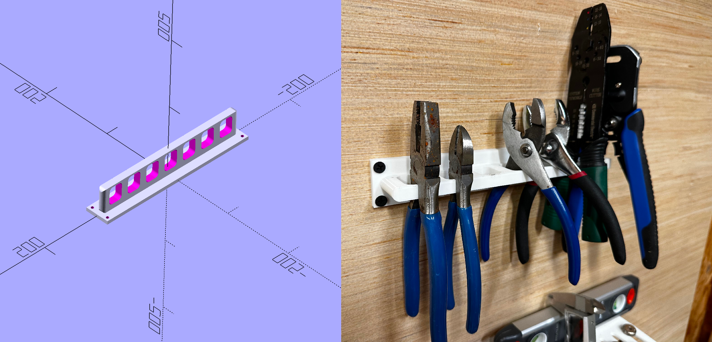
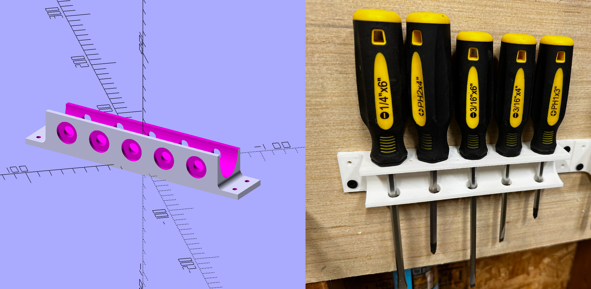
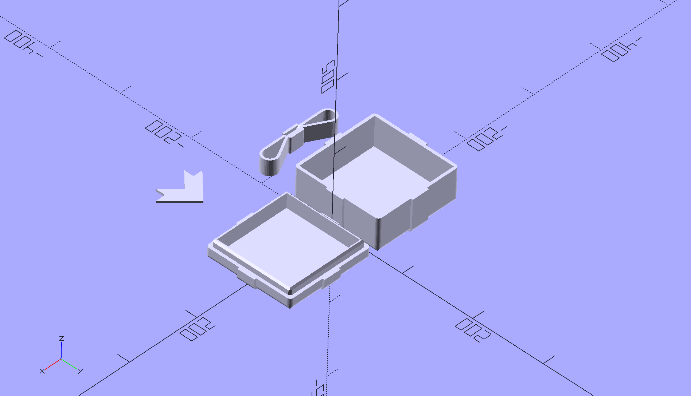
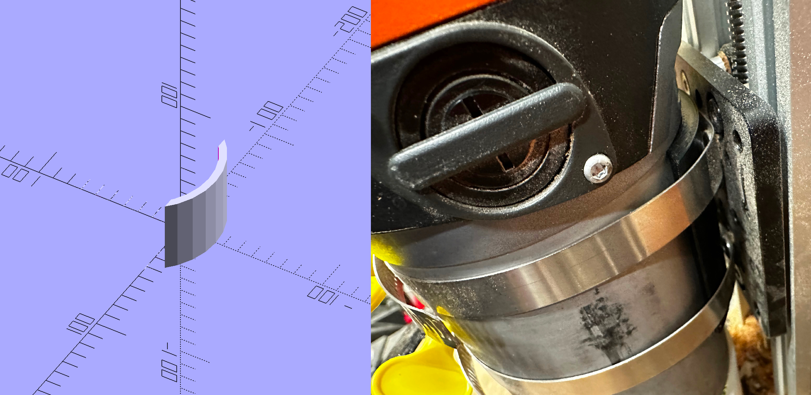
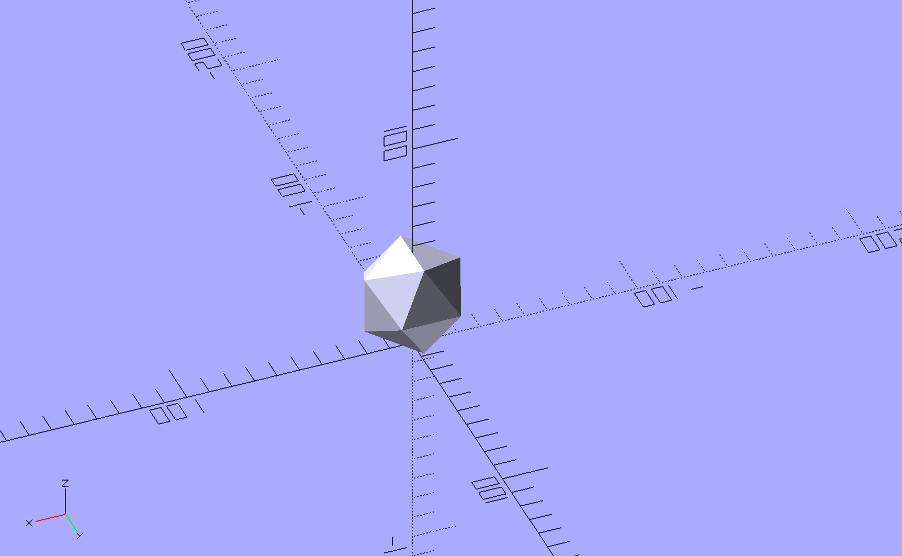
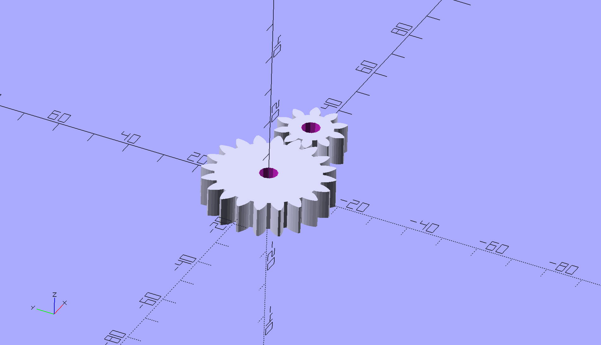

# 3D Models

Just some models I've either made or customized along the way.

## Yahtzee To Go

This started with [Mini Travel Yahtzee](https://www.thingiverse.com/thing:4637069) on Thingiverse, but I decided I wanted some changes. I'm not a fan of folding the scorecards, so I put the clip on. Additionally, I wanted a full size pen and D&D sized D6 dice.

## Triscuit Guard

[TriscuitGuard.f3d](triscuit-guard/TriscuitGuard.f3d)/[stl](triscuit-guard/TriscuitGuard.stl): A Fusion 360 version of the below model. This is finished and printed, though the current size is incorrect. Sizes are parametric, so it'll just be a matter of reprinting with new parameters.

[triscuit-guard.scad](triscuit-guard/triscuit-guard.scad): A WIP panel cover for our [Cat Genie](http://www.catgenie.com) since [Triscuit](https://social.lol/@cws/109734108636670741) has figured out how to press the stop button.

Left to do:
- Some kind of stop to prevent it from pivoting too far
- A detent on the pin to keep in the closed position
- Actual size measurements
- Stop and just use/learn Fusion 360

## Shelf Pin

[pin.scad](pin/pin.scad): [Shelf pins](https://www.printables.com/model/352792-shelf-bracket-pin) that I made to replace broken pins in my cabinets. They seem to be hardy and doing the job. These were my first "real" project designed from scratch.

## Pliers Rack

[pliers.scad](pliers/pliers.scad): A pliers rack that I made from scratch for my tool wall.

## Screwdriver Holder

[screwdriver-holder.scad](screwdriver-holder/screwdriver-holder.scad): A parametric screwdriver holder based on some designs I've seen online. I printed about 5 of these for the tool wall, and they work great.

## Gift Box

[Gift_box.scad](Gift_box/Gift_box.scad): A customization of [Gift Box Customizer](https://www.thingiverse.com/thing:1238814) on Thingiverse.

## Router Shim

[routershim.scad](routershim/routershim.scad): A small shim to scoot the router forward a bit in its mount for my [Maslow CNC](https://www.maslowcnc.com).

## Ball

[ball.scad](ball/ball.scad): A quick icosahedron to use as a projectile for my [Trebuchette](https://www.kickstarter.com/projects/1803756771/trebuchette-the-snap-together-desktop-trebuchet).

## Gear

[gear.scad](gear/gear.scad): Just doodling with gears from the [BOSL2 library](https://github.com/revarbat/BOSL2/wiki).
