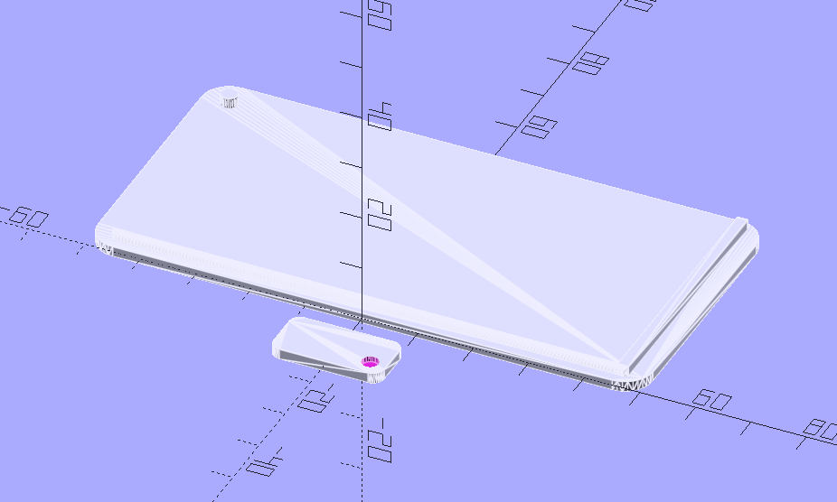
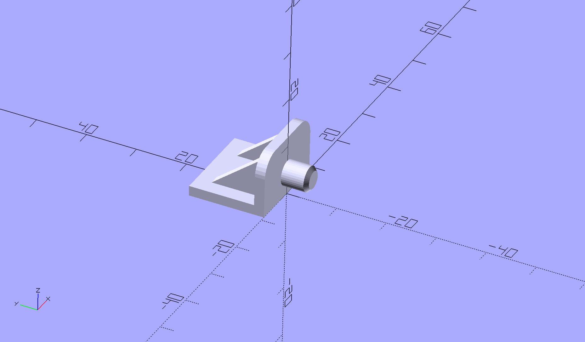
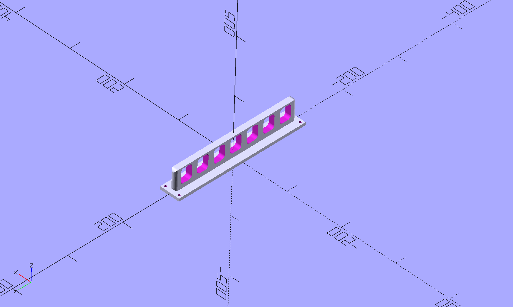
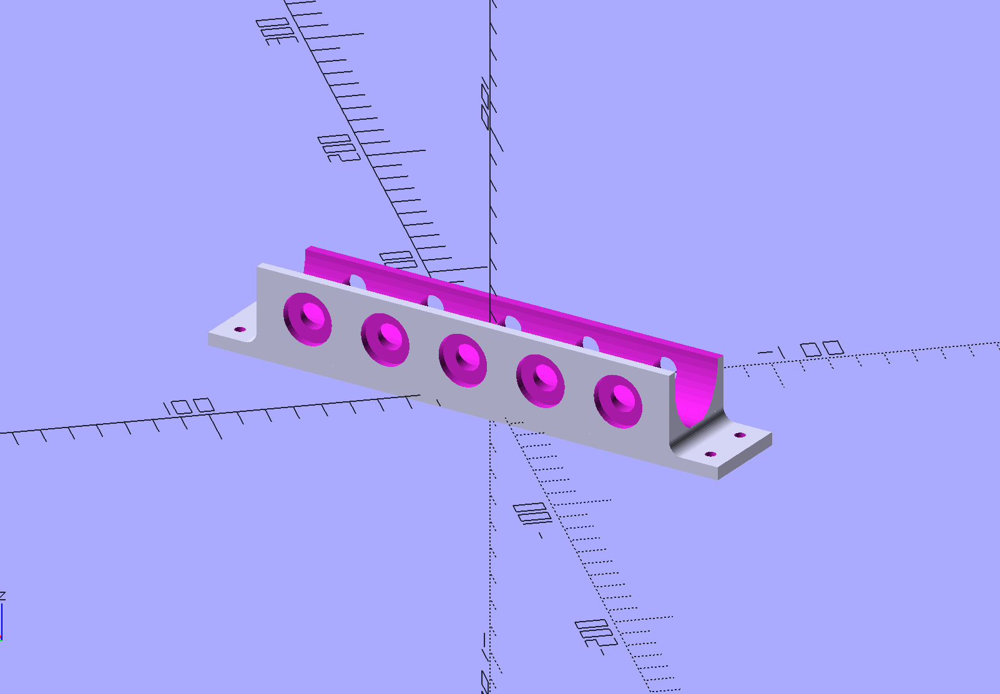
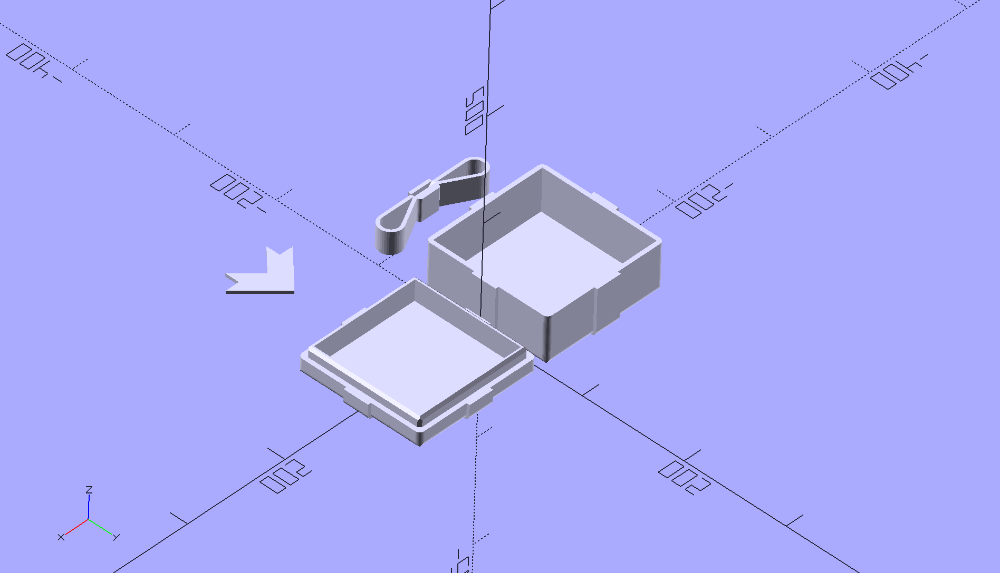
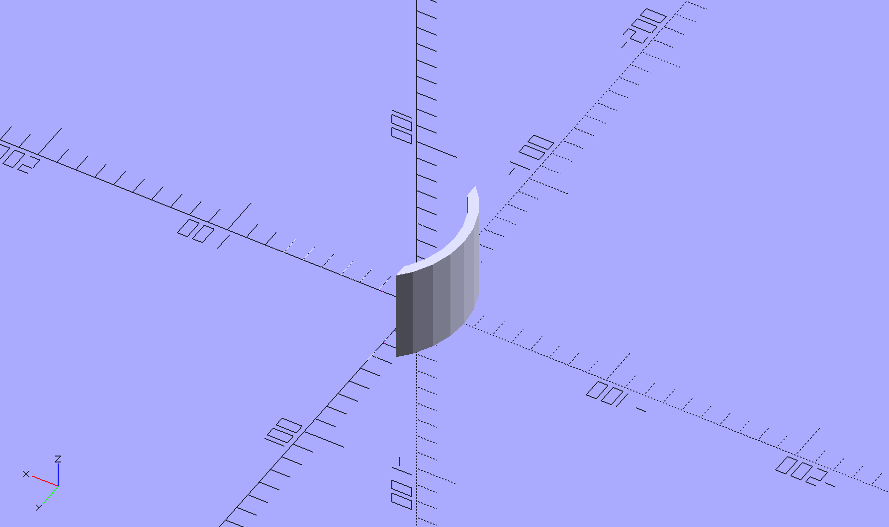
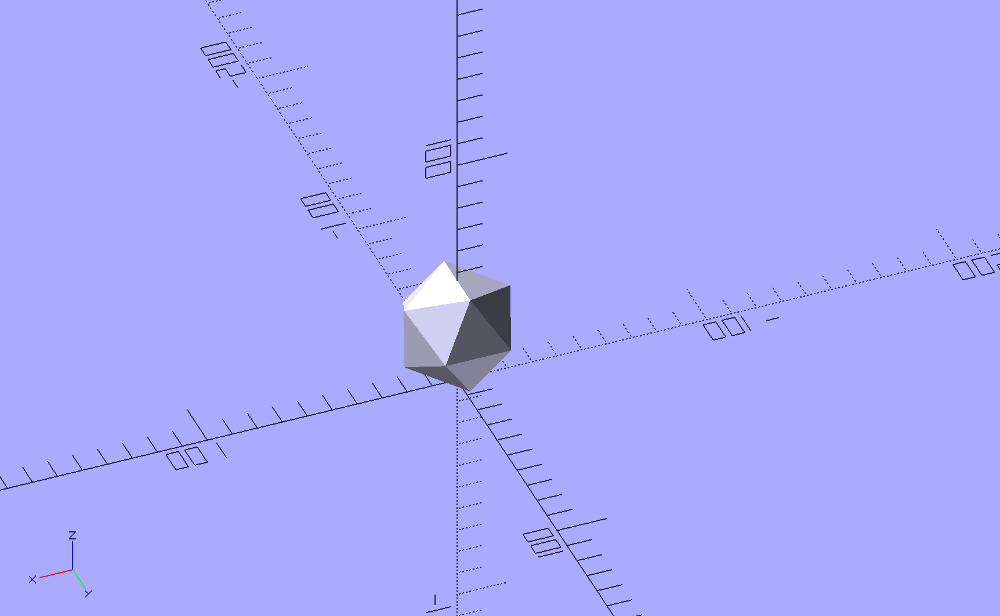
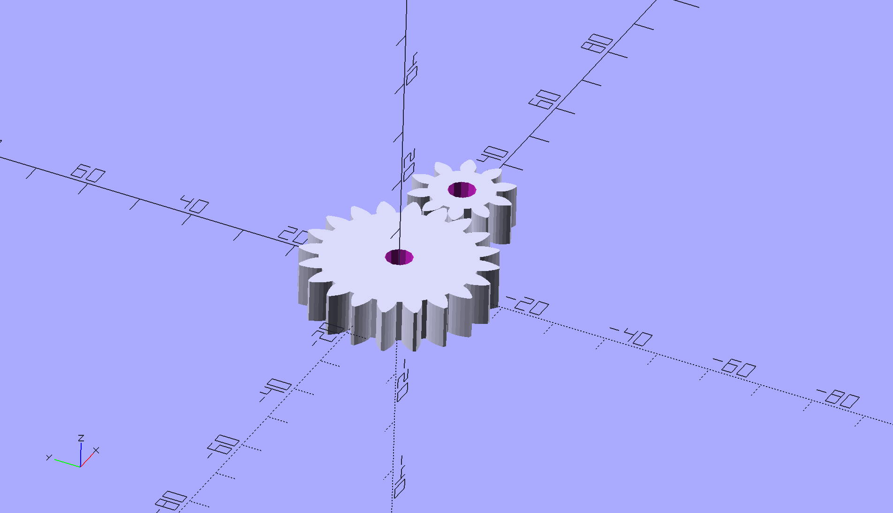

# OpenSCAD Models

Just some models I've either made or customized along the way.

## Triscuit Guard

A WIP panel cover for our [Cat Genie](http://www.catgenie.com) since [Triscuit](https://social.lol/@cws/109734108636670741) has figured out how to press the stop button.

Left to do:
- Some kind of stop to prevent it from pivoting too far
- A detent on the pin to keep in in the closed position
- Actual size measurements

## Shelf Pin

[Shelf pins](https://www.printables.com/model/352792-shelf-bracket-pin) that I made to replace broken pins in my cabinets. They seem to be hardy and doing the job. These were my first "real" project designed from scratch.

## Pliers Rack

A pliers rack that I made from scratch for my tool wall.

## Screwdriver Holder

A parametric screwdriver holder based on some designs I've seen online. I printed about 5 of these for the tool wall, and they work great.

## Gift Box

A customization of [Gift Box Customizer](https://www.thingiverse.com/thing:1238814) on Thingiverse.

## Router Shim

A small shim to scoot the router forward a bit in its mount for my [Maslow CNC](https://www.maslowcnc.com).

## Ball

A quick icosahedron to use as a projectile for my [Trebuchette](https://www.kickstarter.com/projects/1803756771/trebuchette-the-snap-together-desktop-trebuchet).

## Gear

Just doodling with gears from the [BOSL2 library](https://github.com/revarbat/BOSL2/wiki).

